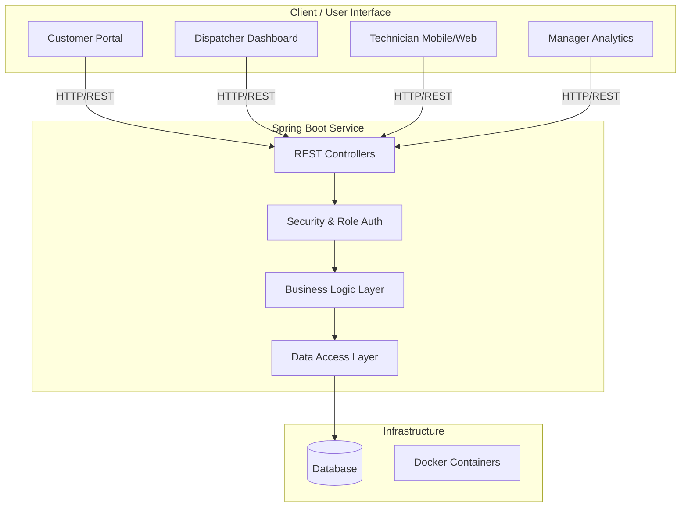
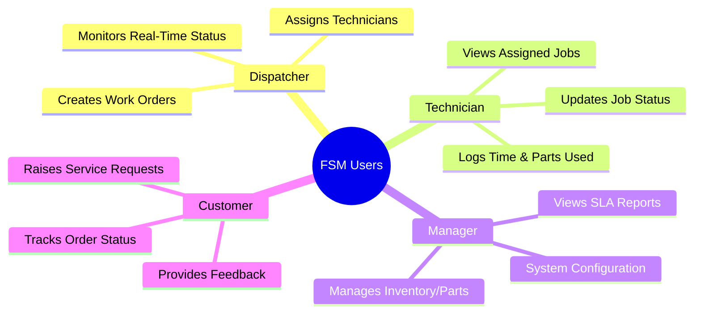
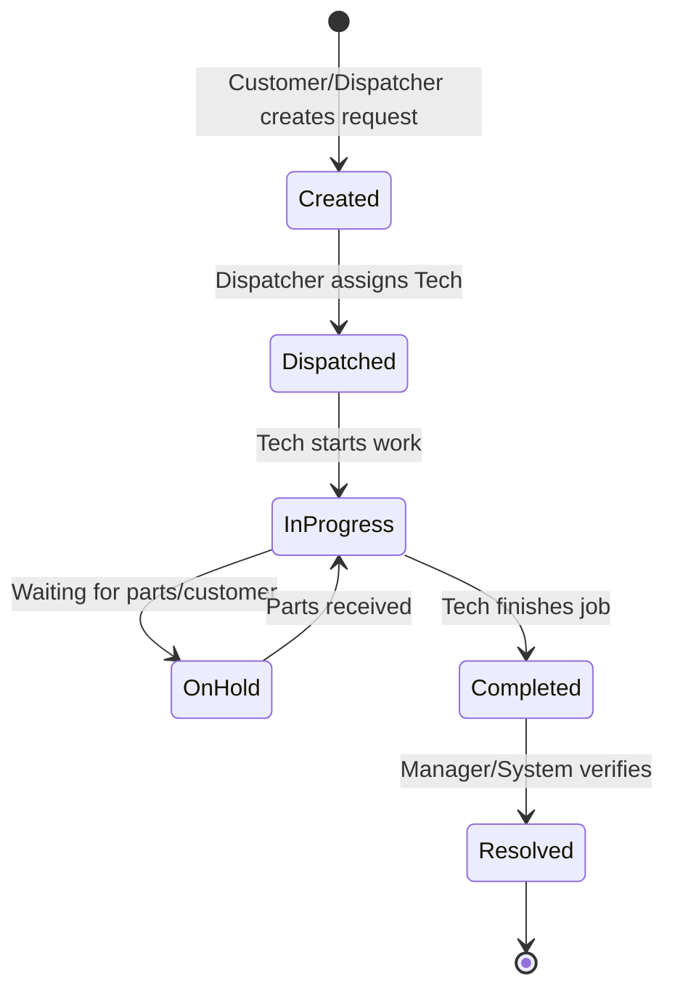

# Field Service Management 🛠️

> A single platform with four kinds of users — dispatcher, technician, manager, and customer — each seeing only what their role needs. Behind it sits a clean, layered Spring Boot service with a governed work-order lifecycle, role-based security, parts and time tracking, SLA monitoring, and reporting.

---

## 🚀 Overview

The **Field Service Management (FSM)** platform streamlines the entire lifecycle of field operations. By providing tailored interfaces and secure access control, it ensures that every stakeholder gets exactly the data and tools they need to function efficiently. 

### Key Features
* **Role-Based Security:** Distinct views and permissions for Dispatchers, Technicians, Managers, and Customers.
* **Governed Work-Order Lifecycle:** End-to-end tracking of service requests from creation to resolution.
* **Resource Tracking:** Real-time monitoring of parts inventory and technician time tracking.
* **SLA Monitoring:** Automated tracking to ensure Service Level Agreements are met.
* **Reporting & Analytics:** Comprehensive data insights for managers.

---

---

## Live URLs

| Service | URL |
|---|---|
| Frontend | https://innovative-wholeness-production-403a.up.railway.app |
| Backend API | https://fieldservicemanagement-production.up.railway.app |
| Swagger UI | https://fieldservicemanagement-production.up.railway.app/swagger-ui/index.html |

## Seed Logins

| Role | Email | Password |
|---|---|---|
| Manager | manager@keystone.com | secret |
| Dispatcher | dispatcher@keystone.com | secret |
| Technician | technician@keystone.com | secret |
| Customer | customer@keystone.com | secret |

---

## Stack

| Layer | Technology |
|---|---|
| Language | Java 21 |
| Backend | Spring Boot 4.x |
| Security | Spring Security + JWT (jjwt) |
| Persistence | Spring Data JPA / Hibernate |
| Database | PostgreSQL 16 |
| Migrations | Flyway |
| Frontend | React + TypeScript (Vite) |
| API Docs | springdoc-openapi (Swagger UI) |
| Deployment | Railway (Docker) |

---

## Architecture

```
frontend/          React + TypeScript SPA (Vite)
backend/
  controller/      Thin REST controllers, auth guards
  service/         Business logic, state machine, SLA
  domain/          JPA entities (8 tables)
  repository/      Spring Data JPA repositories
  security/        JWT filter, SecurityConfig
  dto/             Request/Response DTOs
  resources/
    db/migration/  Flyway versioned SQL scripts (V1-V4)
docker-compose.yml Local PostgreSQL
```

---

## Local Setup

### Prerequisites
- Java 21
- Node 20+
- Docker Desktop

### 1. Start database
```bash
cd keystone
docker compose up -d
```

### 2. Run backend
```bash
cd backend
./mvnw spring-boot:run
```
Backend starts on `http://localhost:8080`

### 3. Run frontend
```bash
cd frontend
npm install
npm run dev
```
Frontend starts on `http://localhost:5173`

### 4. Environment variables (local)
Backend uses `application.properties` with local defaults. No extra setup needed for local dev.

### 5. Seed data
Flyway migrations run automatically on startup:
- `V1__init_schema.sql` — creates all 8 tables
- `V2__seed_users.sql` — seeds 4 users (one per role)
- `V3__fix_seed_passwords.sql` — correct BCrypt hashes
- `V4__seed_parts.sql` — seeds 4 inventory parts

---

## API Endpoints

Full reference available at Swagger UI. Key endpoints:

| Method | Endpoint | Description |
|---|---|---|
| POST | /api/auth/login | Login, returns JWT |
| GET/POST | /api/customers | List or create customers |
| GET/POST | /api/sites | List or create sites |
| GET/POST | /api/work-orders | List or create work orders |
| POST | /api/work-orders/{id}/assign | Assign to technician |
| POST | /api/work-orders/{id}/status | Transition lifecycle status |
| GET | /api/work-orders/{id}/history | Status audit trail |
| POST | /api/work-orders/{id}/parts | Log parts used |
| POST | /api/work-orders/{id}/time | Log time spent |
| GET | /api/reports/summary | Dashboard metrics |

---

## Work Order Lifecycle

```
NEW → ASSIGNED → IN_PROGRESS → COMPLETED → CLOSED
              ↓         ↓
          CANCELLED  ON_HOLD → IN_PROGRESS
```

- Transitions enforced in service layer, not just UI
- Every transition writes an append-only audit row
- Role restrictions: only assigned technician can start/complete, only manager can close
- SLA due dates set on creation based on priority (URGENT=4h, HIGH=24h, MEDIUM=72h, LOW=7d)

---

## Security

- Stateless JWT authentication (24hr expiry)
- BCrypt password hashing
- Server-side role enforcement via `@PreAuthorize`
- Customers scoped to their own data only
- Secrets via environment variables, never committed


## 🏗️ System Architecture

The project relies on a modern, containerized stack:
* **Backend:** Java (Spring Boot) - Clean layered architecture
* **Frontend:** TypeScript & CSS
* **Containerization:** Docker (`docker-compose`)
* **Deployment:** Railway (Production environments enabled)

### Architecture Diagram



---

## 👥 Role-Based Workflows

The platform isolates functionality based on the logged-in user to keep the interface clean and secure.



---

## 🔄 Work-Order Lifecycle

Every work order follows a strict, governed state machine to ensure no job falls through the cracks.



## 🤝 Contributing

Contributions are welcome! Please check out the [Issues](https://github.com/shivamshukla02/FieldServiceManagement/issues) tab to see what needs work.

1. Fork the Project
2. Create your Feature Branch (`git checkout -b feature/AmazingFeature`)
3. Commit your Changes (`git commit -m 'Add some AmazingFeature'`)
4. Push to the Branch (`git push origin feature/AmazingFeature`)
5. Open a Pull Request

---

## 📜 License

This project is licensed under the MIT License.
