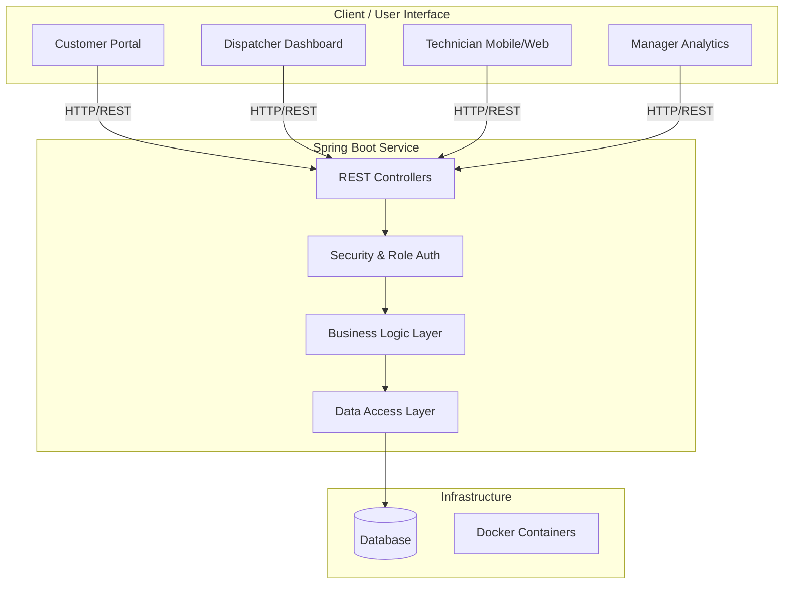
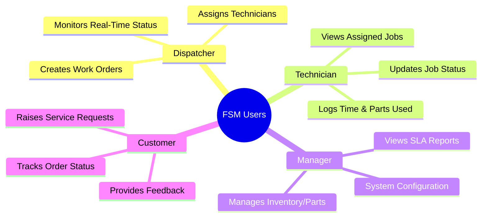
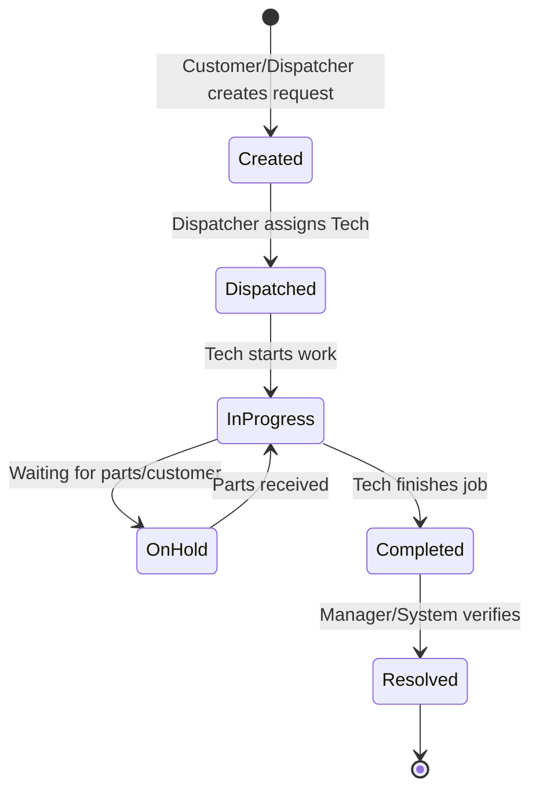

# Field Service Management 🛠️

> A single platform with four kinds of users — dispatcher, technician, manager, and customer — each seeing only what their role needs. Behind it sits a clean, layered Spring Boot service with a governed work-order lifecycle, role-based security, parts and time tracking, SLA monitoring, and reporting.

---

## 🚀 Overview

The **Field Service Management (FSM)** platform streamlines the entire lifecycle of field operations. By providing tailored interfaces and secure access control, it ensures that every stakeholder gets exactly the data and tools they need to function efficiently. 

### Key Features
* **Role-Based Security:** Distinct views and permissions for Dispatchers, Technicians, Managers, and Customers.
* **Governed Work-Order Lifecycle:** End-to-end tracking of service requests from creation to resolution.
* **Resource Tracking:** Real-time monitoring of parts inventory and technician time tracking.
* **SLA Monitoring:** Automated tracking to ensure Service Level Agreements are met.
* **Reporting & Analytics:** Comprehensive data insights for managers.

---

## 🏗️ System Architecture & Tech Stack

The project relies on a modern, containerized stack:
* **Backend:** Java (Spring Boot) - Clean layered architecture
* **Frontend:** TypeScript & CSS
* **Containerization:** Docker (`docker-compose`)
* **Deployment:** Railway (Production environments enabled)

### Architecture Diagram



---

## 👥 Role-Based Workflows

The platform isolates functionality based on the logged-in user to keep the interface clean and secure.



---

## 🔄 Work-Order Lifecycle

Every work order follows a strict, governed state machine to ensure no job falls through the cracks.



---

## 🛠️ Getting Started

### Prerequisites

Make sure you have the following installed on your machine:

* [Docker & Docker Compose](https://www.docker.com/)
* [Java 17+](https://adoptium.net/)
* [Node.js / npm](https://nodejs.org/) (for local frontend development)

### Running Locally with Docker

The easiest way to get the entire stack running is using the provided `docker-compose.yml` file.

1. **Clone the repository:**
```bash
git clone [https://github.com/shivamshukla02/FieldServiceManagement.git](https://github.com/shivamshukla02/FieldServiceManagement.git)
cd FieldServiceManagement

```


2. **Run Docker Compose:**
```bash
docker-compose up --build

```


*Note: This will spin up both the Spring Boot backend and the database/frontend services as configured.*

### Manual Setup (Without Docker)

**Backend:**

```bash
cd backend
./mvnw clean install
./mvnw spring-boot:run

```

**Frontend:**

```bash
cd frontend
npm install
npm start

```

*(Note: Ensure frontend environment variables like `PORT` are set correctly, especially for Railway deployments.)*

---

## 🤝 Contributing

Contributions are welcome! Please check out the [Issues](https://github.com/shivamshukla02/FieldServiceManagement/issues) tab to see what needs work.

1. Fork the Project
2. Create your Feature Branch (`git checkout -b feature/AmazingFeature`)
3. Commit your Changes (`git commit -m 'Add some AmazingFeature'`)
4. Push to the Branch (`git push origin feature/AmazingFeature`)
5. Open a Pull Request

---

## 📜 License

This project is licensed under the MIT License - see the LICENSE file for details.
